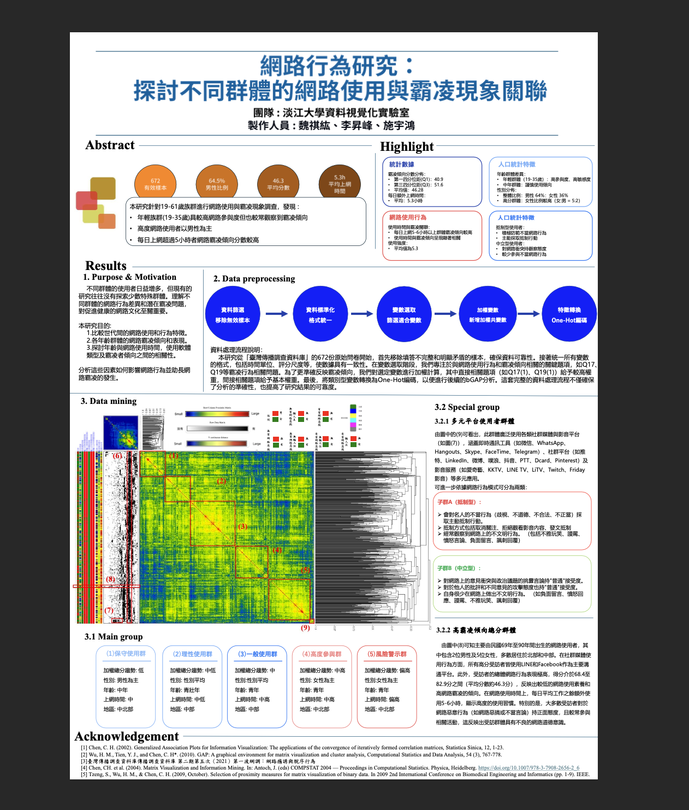

# Internet-behavior
網路行為研究：探討不同群體的網路使用與霸凌現象關聯

動機：

台灣網路霸凌事件較前年增加 32%，且案例性質逐漸從單純的言語衝突，演變為包含人身 攻擊、資訊揭露、群體排擠等多元形式。特別值得注意的是，這類行為已突破年齡限制， 在各年齡層中都呈現不同程度的表現。例如，在 25-45 歲的族群中，超過 40%的受訪者 表示曾目睹或經歷網路霸凌事件，顯示這已不再是青少年特有的問題。

學術界對網路霸凌現象的研究已累積相當成果，但仍存在明顯的研究缺口。首先， 現有研究過度聚焦於青少年群體，對成年人網路霸凌行為的探討相對不足。其次，多數 研究採用單一面向的分析方法，缺乏多變量統計分析的系統性探討。第三，跨世代網路 使用行為的比較研究更是付之闕如，特別是在台灣的社會文化脈絡下。

目的：

1. 建立網路使用者行為分類模型。本研究運用廣義關聯圖(GAP)技術，以驗證主成分分析(PCA)和因素分析(Factor Analysis)等方法，從多維度視角剖析使用者的行 為特徵。透過這些先進的統計工具，我們得以識別出不同類型的網路使用群體，並描繪其獨特的行為模式。

2. 探究人口統計特徵與網路行為的關聯性。本研究特別關注年齡、性別、教育程度 等變數對網路使用模式的影響。這種分析不僅能揭示不同世代的網路使用差異， 更能幫助我們理解社會人口特徵如何塑造網路行為傾向。

3. 建構網路行為與霸凌傾向的因果關係模型。透過典型相關分析(CCA)，本研究探 討網路使用強度、平台選擇、互動方式等因素與霸凌行為的關聯。這一分析將為 網路素養教育和反霸凌政策的制定提供實證基礎。

研究對象：

本研究以「臺灣傳播調查資料庫」中的「二期第二次(2021)二一波網調:網路癮誘與脫序言行為」調查數據為基礎，研究對象涵蓋19-61 歲的網路使用者，有效樣本達 672 位。在網路使用行為模式分析方面，我們深入探討社群媒體平台的選擇與使用頻率，研究使用者如何分配每日網路使用時間，以及他們在不同平台間的互動方式與內容偏好。特別關注使用者在多個平台之間的轉換行為，這些跨平台使用模式可能透露出重要的行為特徵。

詳細內容請查看檔案中PPT以及書面資料

